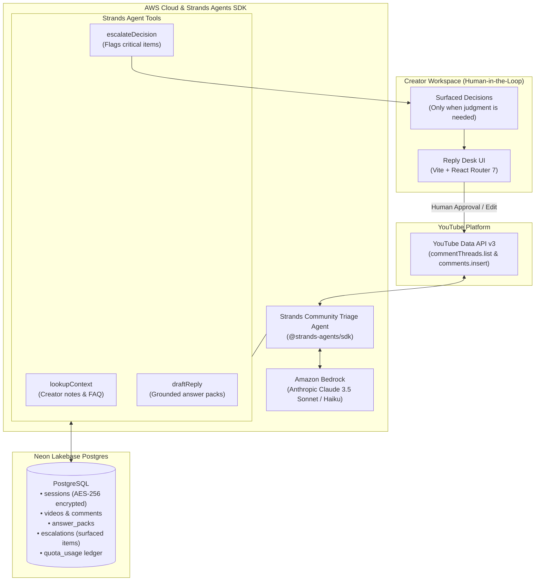

# Comment Relay

> **Autonomous YouTube Community Triage & Reply Desk**  
> *Built with the **AWS Strands Agents SDK** & **Amazon Bedrock** for the **Agents for Humans Hackathon** (Professional Agents Track)*

[](LICENSE)
[](https://github.com/strands-agents/harness-sdk)
[](https://aws.amazon.com/bedrock/)

---

## What is Comment Relay?

YouTube creators, educators, and technical makers lose hours every day to repetitive community tasks: answering the exact same installation errors, explaining environment setup, and acknowledging routine feedback.

Instead of being another dashboard creators have to open and manage all day, **Comment Relay** deploys an autonomous AI agent built on the **AWS Strands Agents SDK** and powered by **Amazon Bedrock**. The agent operates continuously in the background:
- **Handles Routine & Repetitive Tasks**: Automatically ingests incoming comments, groups repeated questions into cohesive answer packs, and prepares grounded response drafts using creator-provided notes and knowledge base context.
- **Surfaces ONLY When There is a Real Decision to Make**: Identifies novel code bugs, tutorial regressions, sponsor inquiries, and high-risk sentiment, escalating them directly to the creator with an actionable recommendation card. The creator reviews and resolves only the decisions that truly require human judgment.

---

## Architecture



### Strands Agent Tools

1. **`lookupContext`**: Fetches creator-curated troubleshooting notes, known fixes, and category definitions for the active video.
2. **`draftReply`**: Generates a warm, group-oriented reply for an answer pack grounded in the comments and context notes (capped under 800 characters).
3. **`escalateDecision`**: Surfaces comments that cannot be answered autonomously—such as reported bugs in video code, sponsorship inquiries, or conflicting instructions—creating a prioritized human review item.

---

## Run locally

```bash
npm install
npm run db:push   # syncs schema to Neon Postgres
npm run dev       # starts Vite frontend on http://localhost:5173
npm run server    # starts Express API on http://localhost:8787
```

`npm run server` loads `.env` and `.env.local` automatically via Node's `--env-file-if-exists`.

### Environment variables

| Variable | Purpose |
| --- | --- |
| `AWS_REGION` | AWS region for Amazon Bedrock (default: `us-east-1`) |
| `AWS_BEDROCK_MODEL_ID` | Model identifier (default: `anthropic.claude-3-5-sonnet-20241022-v2:0`) |
| `AWS_ACCESS_KEY_ID` / `AWS_SECRET_ACCESS_KEY` | AWS credentials with Bedrock model invocation permissions |
| `GOOGLE_CLIENT_ID` / `GOOGLE_CLIENT_SECRET` | Google Cloud OAuth web client credentials |
| `DATABASE_URL` | Neon Postgres connection string |
| `SESSION_ENCRYPTION_KEY` | AES-256 key (base64) encrypting OAuth tokens at rest |
| `CRON_SECRET` | Shared secret for background sync ticks |
| `DAILY_QUOTA_BUDGET` / `PER_CREATOR_DAILY_QUOTA` | YouTube API quota ledger caps (default: 8,000 / 1,500 units) |

---

## Deploying

One Vercel or AWS serverless project serves both halves:
- The **frontend** is the Vite build (`npm run build` -> `dist/`).
- The **API** is the Express app in `server/index.js`, wrapped as a serverless function by `api/index.js`.
- `vercel.ts` rewrites `/api/(.*)` to the API function and all client routes to `index.html`.

---

## Security

- **Tokens are encrypted at rest.** `sessions.tokens` stores an AES-256-GCM envelope (`server/crypto.js`), not raw OAuth tokens — reading the database no longer hands out standing YouTube-posting credentials.
- **Sessions expire, and slide.** Each session carries a 30-day `expiresAt`; `sessionFor()` rejects and deletes expired rows rather than treating a session id as a permanent bearer token, and slides the expiry forward (at most one write per day) while a creator keeps using the app.
- **The OAuth `state` parameter is signed, not stored** (`server/oauthState.js`). It used to live in an in-memory `Set`, which meant the instance that minted a state and the instance that verified it had to be the same process - false on any serverless/multi-instance deployment, and false again after a restart mid-login. It is now an HMAC-signed `<nonce>.<expiry>.<sig>` token with a 10-minute TTL, verifiable by any instance and stored nowhere.
- **Refreshed OAuth tokens are written back** to `sessions.tokens`, re-encrypted, so an expired access token costs one refresh per hour rather than one per request.
- Losing or rotating `SESSION_ENCRYPTION_KEY` invalidates every existing session (creators just reconnect). The same secret keys the OAuth state HMAC, so rotating it also invalidates any login in flight.

## Multi-tenancy and quota

All creators currently authenticate through one shared Google Cloud OAuth app, which means they share one YouTube Data API quota pool (10,000 units/day by default). `server/quota.js` tracks daily usage per creator and as a `__global__` aggregate in the `quota_usage` table, and every YouTube API call site (listing videos, fetching comments, posting replies) charges against it. `DAILY_QUOTA_BUDGET` caps the shared pool below Google's real limit (leaving headroom); `PER_CREATOR_DAILY_QUOTA` caps any single creator's share, so one large channel's sync can't starve everyone else's.

The ledger buckets usage by **Pacific Time** day, matching when Google's own quota resets - bucketing by UTC put the accounting 7-8 hours out of step, so the app could believe it had budget hours after Google's pool was actually spent.

Every YouTube call site is gated, including the expensive one: `comments.insert` costs 50 units apiece (versus 1 for a read), and `POST /api/replies` now both checks the budget before sending and caps a single batch at 25 comments. Previously it recorded usage without ever checking it, so one oversized request could drain the shared daily pool for every creator.

If a sync job runs into either cap, it pauses (`status: 'paused_quota'`) instead of failing, and picks back up automatically once the day's usage resets.

## Video sync: resumable and chunked

`POST /api/videos/sync` used to walk every video on a channel in one blocking request — fine for a handful of videos, but guaranteed to hit a serverless function timeout on a channel with hundreds. It's now a resumable job (`sync_jobs` table, driven by `server/sync.js`):

- Each call advances the job for up to ~20 seconds — enough for a small/medium channel to finish in the one click that triggered it.
- A large channel naturally stops partway through; the frontend polls `GET /api/videos/sync/status` and automatically re-triggers the next chunk while a job is `running`. A job that hit the quota cap is polled rather than re-triggered until something resumes it, so the progress bar recovers on its own instead of freezing until a manual click.
- **Vercel Cron** hits `GET /api/internal/sync/tick` every minute (see `vercel.ts`), authenticated with `CRON_SECRET`, so large-channel syncs keep draining even if nobody has the app open. (Minute-level crons need a Pro plan; on Hobby, drop the schedule to daily.)
- **Jobs are claimed before they are advanced.** The creator's own sync click and the every-minute cron tick can fire at the same moment; without a claim, both workers read the same cursor, made the same YouTube calls (double-charging quota), and the slower write moved `index` *backwards*. `sync_jobs.locked_until` is compare-and-swapped forward by a single conditional `UPDATE`, so exactly one worker proceeds and the other backs off.
- **The cursor holds only video ids.** Phase 1 writes the channel's videos to the `videos` table straight away and keeps just `{ videoIds, index }` in the job - it used to carry every video's full record and rewrite that whole JSONB blob on each 10-video chunk. The creator also sees their video list as soon as the listing phase lands, instead of waiting for the entire sync to finish.
- `GET /api/videos` still serves the cached, already-ranked list — cheap and quota-free, safe to call on every workspace load.

## How comments are grouped

Comments are classified with a plain keyword match on the lowercased text (`server/classify.js`) — no model call. Unlike the original hardcoded version, **categories are per-creator and editable** (`GET/POST/PUT/DELETE /api/categories`, or the "Edit categories" panel in the workspace). Every new creator is seeded with 4 defaults on first sign-in, checked in this order so an earlier category always wins ties (e.g. a thank-you that also mentions "error" still lands in Positive feedback, not Install error):

| Pack | Priority | Trigger words |
| --- | --- | --- |
| Positive feedback | Low | `thank`, `great`, `clear`, `love`, `helped`, `finally` |
| Install error | High | `install`, `npm`, `package`, `node`, `error`, `fail`, `cannot`, `can't`, `not work` |
| Environment setup | Medium | `api key`, `.env`, `environment`, `restart`, `variable` |
| Needs review | Medium | catch-all — anything matching none of the above |

These defaults were written for one specific coding tutorial and won't generalize out of the box — a cooking channel or a vlog will see most comments land in "Needs review" until the creator edits their categories' keywords (or adds new ones) to match their own content.

## Database migrations

Schema changes are tracked as migrations (`server/db/migrations/`) instead of applied ad hoc:

```bash
npm run db:generate   # after editing server/db/schema.js — writes a new migration file
npm run db:migrate     # applies pending migrations
```

`npm run db:push` still works for quick local iteration (and is what an already-`db:push`-managed database should run once to pick up this change's new tables/columns), but `generate`/`migrate` is the path going forward so schema history is versioned and reviewable.

## Known limitations

This started as a foundational-hardening pass on top of an early prototype; the areas below have since been filled in end-to-end:

- **The frontend is now routed and modular** (`react-router-dom`, `src/pages/` + `src/context/AppState.jsx`) instead of one large component.
- **The signed-in identity is real** — the sidebar/avatar reflects the connected creator's channel title, sourced from `GET /api/auth/status`, falling back to a demo persona only when nothing's connected.
- **"Edit context" persists** — the composer's context note is saved per answer-pack (`answerPacks.context`) instead of resetting on reload, and the old no-op button is gone (the field was always directly editable).
- **The connected-videos list is paginated** (`GET /api/videos?limit=&offset=`), with a pager in the UI.
- **"Sent replies" is live** — `GET /api/sent-replies` reads back what `POST /api/replies` has always written, with its own page and pagination.
- **Classification has an AI-assisted upgrade** — see [AI features](#ai-features-reclassify--draft-generation). Keyword matching (`server/classify.js`) is still the instant/free default during sync; "Reclassify with AI" and "AI DRAFT" are explicit, creator-triggered actions through the Vercel AI Gateway.

Still open, deferred to a follow-up:

- **No rate limiting** on any endpoint. The quota ledger bounds YouTube API spend, but nothing bounds request volume itself.
- **AI spend is unmetered.** `server/quota.js` covers YouTube quota; there is no equivalent ledger for the AI Gateway, so "Reclassify with AI" and "AI DRAFT" can be clicked without bound.
- **Per-creator quota isolation is a shared pool, not hard isolation** - see [Multi-tenancy and quota](#multi-tenancy-and-quota). A creator who needs guaranteed throughput would need their own Google Cloud OAuth app (not yet supported).
- **The session id travels in a URL query parameter** on the OAuth redirect (`/?session=...`) before being moved into `sessionStorage`. It is scrubbed from the address bar, but not from browser history or any intermediate log. An httpOnly cookie would be the right shape.
- **No transactions.** `neon-http` sends each statement as its own request, so a sync chunk that fails partway can leave videos persisted without their comments.
- **No linter.** There is no ESLint config in the repo despite `eslint-disable` comments in the source; CI runs `build` + `test` only.

None of these block the core flow (sync → group → draft → send), but they're worth knowing about before relying on this for real day-to-day use across many creators.
